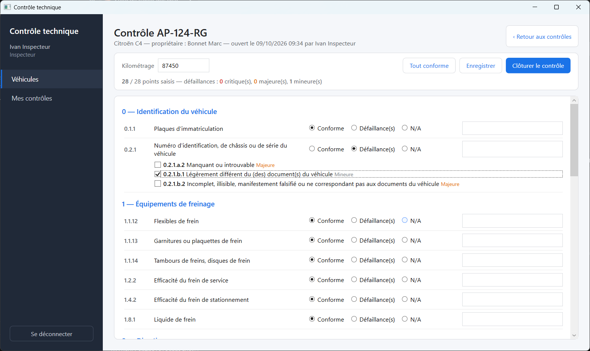
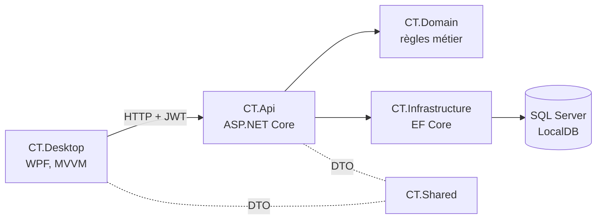
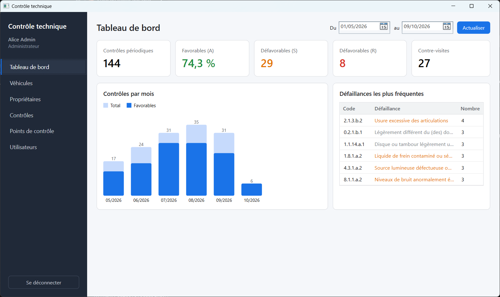
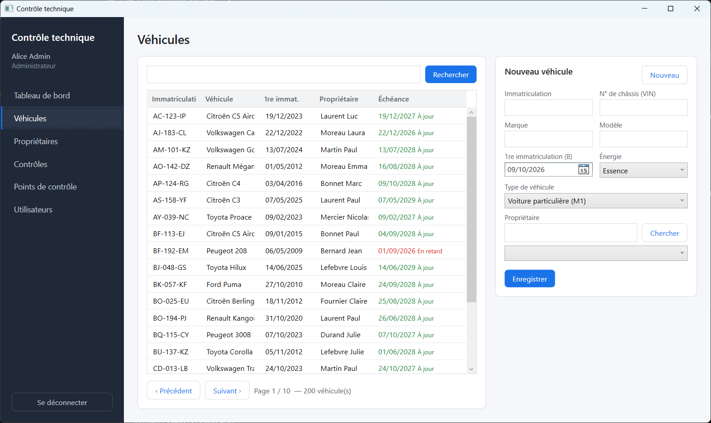
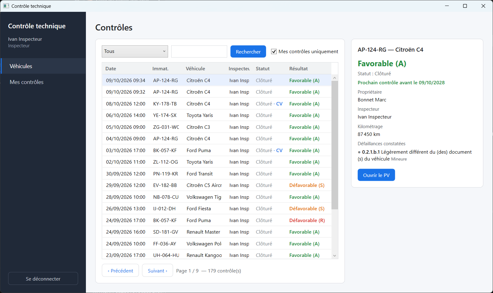
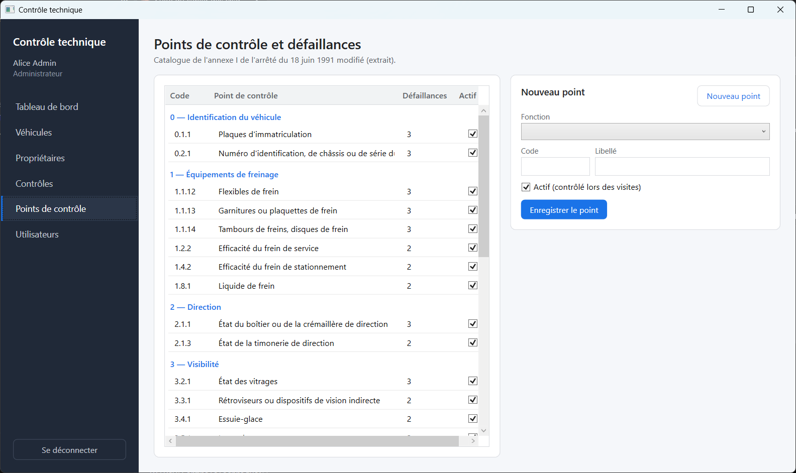

# Contrôle Technique

Gestion des contrôles techniques de véhicules légers, conforme à la réglementation française : API REST ASP.NET Core, base SQL Server et application de bureau WPF.

[](https://github.com/Darkepsilon22/ControleTechnique/actions/workflows/ci.yml)




## Sommaire

- [Présentation](#présentation)
- [Fonctionnalités](#fonctionnalités)
- [Règles réglementaires](#règles-réglementaires)
- [Architecture](#architecture)
- [Stack technique](#stack-technique)
- [Démarrage rapide](#démarrage-rapide)
- [API](#api)
- [Tests et qualité](#tests-et-qualité)
- [Performance](#performance)
- [Captures d'écran](#captures-décran)
- [Sources](#sources)

## Présentation

L'application couvre le travail d'un centre de contrôle technique pour les véhicules de catégories M1 et N1 (3,5 t maximum) :

- la **réception** enregistre les propriétaires et les véhicules ;
- l'**inspecteur** saisit le contrôle à partir du catalogue officiel des défaillances, le clôture et édite le procès-verbal ;
- l'**administrateur** gère les comptes, le catalogue et suit l'activité du centre.

Les règles de résultat, de validité et de contre-visite suivent l'arrêté du 18 juin 1991 modifié.

> [!NOTE]
> Projet personnel de démonstration. Il ne s'agit pas d'un logiciel agréé : aucune connexion à l'OTC ni au SIV, et toutes les données sont fictives.

## Fonctionnalités

| Domaine | Fonctionnalités |
| --- | --- |
| Contrôle | Checklist organisée par fonction de l'annexe I ; pour chaque point : conforme, non applicable ou défaillance(s) avec leur code officiel ; points d'émissions selon l'énergie (essence ou diesel) |
| Résultat | Calcul automatique A, S ou R ; validité et date limite de contre-visite ; contrôle verrouillé après clôture |
| Contre-visite | Ouverture sous 2 mois après le contrôle périodique ; points revérifiés déterminés selon l'annexe I |
| Procès-verbal | PDF avec identification du véhicule, résultat, échéance et défaillances classées par niveau |
| Véhicules | Recherche paginée, unicité de l'immatriculation et du VIN, échéance du prochain contrôle (à jour, en retard, contre-visite à faire, circulation interdite) |
| Catalogue | 9 fonctions, 29 points et 76 défaillances officiels, administrables |
| Tableau de bord | Contrôles par mois, taux de favorables, résultats S et R, contre-visites, défaillances les plus fréquentes |
| Sécurité | Authentification JWT, trois rôles, mots de passe hachés avec BCrypt, clé de signature hors du dépôt |

## Règles réglementaires

| Règle | Référence |
| --- | --- |
| Aucune défaillance majeure ni critique : **favorable (A)**, valable 2 ans | Arrêté du 18 juin 1991, art. 4 et 7 |
| Au moins une défaillance majeure : **défavorable (S)**, contre-visite sous 2 mois | Art. 7 |
| Au moins une défaillance critique : **défavorable (R)**, circulation autorisée jusqu'à minuit le jour du contrôle | Art. 7 |
| Niveau d'une défaillance donné par le dernier chiffre de son code : 1 mineure, 2 majeure, 3 critique | Annexe I |
| Contre-visite au-delà de 2 mois : nouveau contrôle périodique complet | Art. 7 et 8 |
| Points revérifiés en contre-visite : fonction 0 et point 7.11.1 toujours ; fonction entière pour les fonctions 1 et 2 ; ensemble de points concerné pour les autres, avec les extensions prévues (5.1/5.3, 8.1/8.2 et 6.1.2/6.1.3) | Annexe I, section F |
| Contre-visite favorable : validité de 2 ans à compter du contrôle périodique | Art. 4 |
| Premier contrôle avant le 4e anniversaire de la première immatriculation, puis tous les 2 ans | Code de la route |

Ces règles sont implémentées dans la couche domaine ([`Reglementation`](src/CT.Domain/Rules/Reglementation.cs), [`RegleContreVisite`](src/CT.Domain/Rules/RegleContreVisite.cs), [`EcheanceControle`](src/CT.Domain/Rules/EcheanceControle.cs), [`Controle`](src/CT.Domain/Entities/Controle.cs)) et couvertes par des tests unitaires.

**Hors périmètre** : catalogue complet (133 points, 610 défaillances), contrôle complémentaire annuel des utilitaires (art. 4-1), véhicules de collection, seuils de mesure des appareils (freinage, opacité).

## Architecture



```
src/
├── CT.Domain/          Entités, règles réglementaires, exceptions métier
├── CT.Infrastructure/  DbContext, configurations EF Core, migrations, catalogue, données de démonstration
├── CT.Api/             Contrôleurs, services applicatifs, JWT, PDF, gestion des erreurs
├── CT.Shared/          DTO et énumérations partagés par l'API et les clients
└── CT.Desktop/         Application WPF (MVVM)
tests/
└── CT.Tests/           Tests unitaires et tests d'intégration
scripts/                Mesure des temps de réponse
docs/                   Captures d'écran, script de démonstration
```

Principes retenus :

- **Couches séparées** : les règles métier vivent dans le domaine ; les contrôleurs délèguent aux services ; seule l'API accède à la base.
- **Contrats explicites** : l'API n'expose que des DTO, jamais les entités.
- **Erreurs normalisées** : les exceptions métier sont converties en `ProblemDetails` (400, 403, 404, 409).
- **Identifiants GUID** générés par l'application, pour permettre une saisie hors ligne sans conflit.

## Stack technique

| Couche | Technologies |
| --- | --- |
| API | ASP.NET Core 10, JWT Bearer, OpenAPI, Scalar, QuestPDF |
| Données | Entity Framework Core 10, SQL Server LocalDB, migrations versionnées |
| Bureau | WPF, CommunityToolkit.Mvvm, Microsoft.Extensions.DependencyInjection |
| Tests | xUnit, WebApplicationFactory, SQLite en mémoire |
| CI | GitHub Actions (build et tests à chaque pull request) |

## Démarrage rapide

### Prérequis

- Windows 10 ou 11
- [SDK .NET 10](https://dotnet.microsoft.com/download)
- SQL Server Express LocalDB (instance `MSSQLLocalDB`)

### Installation

```powershell
git clone https://github.com/Darkepsilon22/ControleTechnique.git
cd ControleTechnique

# Clé de signature JWT, stockée hors du dépôt (32 caractères minimum)
dotnet user-secrets set "Jwt:Key" "<clé-aléatoire-de-32-caractères-minimum>" --project src/CT.Api
```

### Lancement

```powershell
# Terminal 1 : l'API crée la base, applique les migrations et insère les données de démonstration
dotnet run --project src/CT.Api

# Terminal 2 : application de bureau
dotnet run --project src/CT.Desktop
```

L'API écoute sur `http://localhost:5092`. L'application de bureau peut viser une autre adresse avec la variable d'environnement `CT_API_URL`.

### Comptes de démonstration

| Rôle | E-mail | Mot de passe |
| --- | --- | --- |
| Administrateur | `admin@ct.local` | `Demo123!` |
| Inspecteur | `inspecteur@ct.local` | `Demo123!` |
| Réception | `reception@ct.local` | `Demo123!` |

La base de démonstration contient le catalogue réglementaire, 200 véhicules et environ 150 contrôles des six derniers mois. Un parcours de démonstration en 3 minutes est décrit dans [docs/demo.md](docs/demo.md).

## API

La documentation interactive est disponible sur <http://localhost:5092/scalar/v1> et le document OpenAPI sur `/openapi/v1.json`.

<details>
<summary>Endpoints</summary>

| Méthode et route | Rôles |
| --- | --- |
| `POST /api/auth/login` | Public |
| `GET, POST /api/utilisateurs` · `PUT /api/utilisateurs/{id}` | Administrateur |
| `GET, POST /api/proprietaires` · `PUT /api/proprietaires/{id}` | Administrateur, Réception |
| `GET /api/vehicules` · `GET /api/vehicules/{id}` · `GET /api/vehicules/{id}/controles` | Tous |
| `POST /api/vehicules` · `PUT /api/vehicules/{id}` | Administrateur, Réception |
| `GET /api/points-controle` | Tous |
| `POST /api/points-controle` · `POST /api/points-controle/{id}/defaillances` | Administrateur |
| `GET /api/controles` · `GET /api/controles/{id}` · `GET /api/controles/{id}/pv` | Tous |
| `POST /api/controles` · `PUT /api/controles/{id}` · `POST /api/controles/{id}/cloturer` · `POST /api/controles/{id}/contre-visite` | Inspecteur |
| `GET /api/statistiques/resume` | Administrateur |

Des requêtes prêtes à l'emploi sont fournies dans [src/CT.Api/CT.Api.http](src/CT.Api/CT.Api.http).

</details>

## Tests et qualité

```powershell
dotnet test
```

- **Tests unitaires** des règles réglementaires : résultat A/S/R, validités, niveau déduit du code, points revérifiés en contre-visite, délais, échéance des véhicules, saisie et clôture.
- **Tests d'intégration** de l'API (`WebApplicationFactory`, SQLite en mémoire) : authentification, autorisations par rôle, validation, conflits, parcours complet jusqu'au PV et contre-visite.
- **Intégration continue** : build et tests exécutés par GitHub Actions sur chaque pull request.

## Performance

Objectif : réponse inférieure à 500 ms avec 10 000 véhicules. Mesure reproductible :

```powershell
dotnet run --project src/CT.Api -- --Demo:VehiculesDeCharge=10000
.\scripts\mesurer-performance.ps1
```

| Requête (10 000 véhicules, LocalDB) | Médiane | 95e centile |
| --- | --- | --- |
| Véhicules, page 1 | 11 ms | 26 ms |
| Véhicules, dernière page | 38 ms | 54 ms |
| Recherche par immatriculation | 54 ms | 90 ms |
| Recherche par numéro de châssis | 36 ms | 53 ms |
| Recherche par propriétaire | 37 ms | 66 ms |
| Contrôles, page 1 | 8 ms | 11 ms |
| Statistiques sur 6 mois | 13 ms | 19 ms |

## Captures d'écran

| Tableau de bord | Véhicules |
| --- | --- |
|  |  |
| **Contrôles** | **Catalogue réglementaire** |
|  |  |

## Sources

- [Arrêté du 18 juin 1991 modifié](https://www.legifrance.gouv.fr/loda/id/LEGITEXT000020559004), articles 4, 7 et 8 (Légifrance)
- [Annexe I de l'arrêté](https://www.legifrance.gouv.fr/loda/article_lc/LEGIARTI000042548649) : fonctions, points, défaillances et contre-visites (Légifrance)
- Instructions techniques véhicules légers, par exemple [IT VL F1 Freinage](https://fna.fr/wp-content/uploads/2023/05/IT-VL-F1E-FREINAGE-171018.pdf) et [IT VL F5 Liaisons au sol](https://fna.fr/wp-content/uploads/2023/05/IT-VL-F5E-LIAISON-AU-SOL-23022022.pdf)
