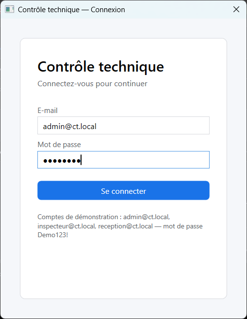

# Contrôle technique — gestion des contrôles de véhicules (C# / .NET 10)

Application de démonstration qui gère les contrôles techniques d'un centre fictif : une **API REST ASP.NET Core** sécurisée par JWT, une base **SQL Server LocalDB** créée automatiquement, et une **application WPF (MVVM)** utilisée par trois rôles : administrateur, inspecteur et réception.

> Projet personnel et fictif : les données, les points de contrôle et les règles de calcul sont simplifiés et ne reprennent aucune réglementation officielle.


## Fonctionnalités

| Module | Ce qui est fait |
| --- | --- |
| Authentification | Connexion par e-mail et mot de passe (BCrypt), jeton JWT de 8 h, droits par rôle sur chaque endpoint |
| Utilisateurs | L'administrateur crée, modifie et désactive les comptes |
| Propriétaires et véhicules | Création, modification, recherche paginée ; immatriculation et n° de châssis uniques |
| Points de contrôle | 25 points fournis (7 catégories, gravité mineure, majeure ou critique) ; un point désactivé n'est jamais supprimé |
| Contrôles | Ouverture par l'inspecteur, saisie point par point (conforme, non conforme, N/A, commentaire), clôture avec calcul automatique du résultat |
| Procès-verbal | PV en PDF (QuestPDF) : véhicule, propriétaire, inspecteur, résultat, points non conformes, date de fin de validité |
| Tableau de bord | Contrôles par mois, taux de favorables, points le plus souvent non conformes |

### Règles de calcul du résultat

- Au moins un point **majeur ou critique** non conforme : résultat **Défavorable**.
- Sinon : résultat **Favorable**, et les points mineurs non conformes deviennent des observations.
- Fin de validité : date du contrôle + 12 mois (paramètre `Controles:DureeValiditeMois`), aucune date pour un défavorable.
- Un contrôle clôturé n'est plus modifiable. La règle est appliquée dans le domaine, pas seulement dans l'interface.

## Architecture

```
src/
  CT.Domain/          entités, énumérations, règles métier (calcul du résultat, clôture)
  CT.Infrastructure/  DbContext EF Core, configurations, migrations, seed, hachage BCrypt
  CT.Api/             contrôleurs, services, JWT, PDF, gestion des erreurs (ProblemDetails)
  CT.Shared/          DTO et énumérations partagés par l'API et les clients
  CT.Desktop/         application WPF (MVVM avec CommunityToolkit.Mvvm)
tests/
  CT.Tests/           tests unitaires du domaine et tests d'intégration de l'API (xUnit)
docs/captures/        captures d'écran
```

- Le client WPF ne parle qu'à l'API ; seule l'API lit et écrit dans SQL Server.
- Un contrôleur appelle un service, le service contient la logique et utilise le DbContext. L'API ne renvoie jamais d'entité, uniquement des DTO.
- Toutes les clés sont des GUID générés par le code, pour permettre plus tard une saisie hors ligne sans conflit d'identifiant.
- Les erreurs métier deviennent des réponses HTTP claires : 400 (validation, règle métier), 401, 403, 404, 409 (immatriculation déjà utilisée, contrôle déjà clôturé).

## Prérequis

- Windows avec le **SDK .NET 10**
- **SQL Server Express LocalDB** (instance `MSSQLLocalDB`)
- Aucune virtualisation : ni Docker, ni WSL

## Lancer le projet

```powershell
git clone https://github.com/Darkepsilon22/ControleTechnique.git
cd ControleTechnique

# 1. Clé de signature JWT, stockée hors du dépôt (au moins 32 caractères)
cd src/CT.Api
dotnet user-secrets set "Jwt:Key" "une-cle-aleatoire-d-au-moins-32-caracteres"
cd ../..

# 2. API : crée la base LocalDB, applique les migrations et insère les données de démonstration
dotnet run --project src/CT.Api
```

L'API écoute sur `http://localhost:5092`. L'interface OpenAPI (Scalar) est disponible sur <http://localhost:5092/scalar/v1> ; le document OpenAPI brut est servi sur `/openapi/v1.json`.

Dans un second terminal :

```powershell
# 3. Application desktop
dotnet run --project src/CT.Desktop
```

Pour viser une autre adresse d'API : variable d'environnement `CT_API_URL`, par exemple `https://localhost:7169/`.

### Comptes de démonstration

| Rôle | E-mail | Mot de passe |
| --- | --- | --- |
| Administrateur | admin@ct.local | Demo123! |
| Inspecteur | inspecteur@ct.local | Demo123! |
| Réception | reception@ct.local | Demo123! |

La base de démonstration contient 25 points de contrôle, 120 propriétaires, 200 véhicules et 150 contrôles clôturés sur les six derniers mois.

Un déroulé de démonstration en 3 minutes est décrit dans [docs/demo.md](docs/demo.md).

## Tests

```powershell
dotnet test
```

- **Tests unitaires** sur les règles métier : calcul du résultat, date de fin de validité, saisie, clôture et refus de toute modification après clôture.
- **Tests d'intégration** de l'API avec `WebApplicationFactory` et SQLite en mémoire : connexion valide (200) et invalide (401), absence de jeton (401), rôle insuffisant (403), immatriculation en double (409), données invalides (400), parcours complet jusqu'au PV.

## Performance

Exigence : réponse sous 500 ms en local avec 10 000 véhicules. Pour la vérifier, l'option `Demo:VehiculesDeCharge` complète la base jusqu'au nombre de véhicules demandé, puis un script chronomètre les principales requêtes :

```powershell
dotnet run --project src/CT.Api -- --Demo:VehiculesDeCharge=10000
.\scripts\mesurer-performance.ps1
```

Résultats sur LocalDB, 10 000 véhicules, 20 mesures par requête (temps HTTP complets, en ms) :

| Requête | Médiane | 95e centile |
| --- | --- | --- |
| Véhicules, page 1 | 5,5 | 6,7 |
| Véhicules, dernière page | 20,1 | 23,3 |
| Recherche d'immatriculation | 33,1 | 37,1 |
| Recherche de n° de châssis | 22,0 | 25,0 |
| Recherche de propriétaire | 21,2 | 35,4 |
| Propriétaires, page 1 | 3,0 | 11,2 |
| Contrôles, page 1 | 3,4 | 4,8 |
| Statistiques sur 6 mois | 4,1 | 5,5 |

Le script renvoie un code d'erreur si une requête dépasse le seuil.

## Endpoints principaux

| Méthode et route | Rôles |
| --- | --- |
| `POST /api/auth/login` | Public |
| `GET, POST /api/utilisateurs`, `PUT /api/utilisateurs/{id}` | Administrateur |
| `GET, POST /api/proprietaires`, `PUT /api/proprietaires/{id}` | Administrateur, Réception |
| `GET /api/vehicules?search=&page=`, `GET /api/vehicules/{id}`, `GET /api/vehicules/{id}/controles` | Tous |
| `POST /api/vehicules`, `PUT /api/vehicules/{id}` | Administrateur, Réception |
| `GET /api/points-controle` | Tous |
| `POST /api/points-controle` (création ou modification) | Administrateur |
| `GET /api/controles?statut=&search=&mesControles=`, `GET /api/controles/{id}` | Tous |
| `POST /api/controles`, `PUT /api/controles/{id}`, `POST /api/controles/{id}/cloturer` | Inspecteur (ses propres contrôles) |
| `GET /api/controles/{id}/pv` | Tous |
| `GET /api/statistiques/resume?du=&au=` | Administrateur |

Le fichier [src/CT.Api/CT.Api.http](src/CT.Api/CT.Api.http) contient des requêtes prêtes à l'emploi.

## Captures d'écran

| | |
| --- | --- |
|  |  |
|  |  |
|  |  |

## Technologies

C# 14, .NET 10, ASP.NET Core, Entity Framework Core 10, SQL Server LocalDB, JWT, BCrypt, QuestPDF (licence Community), Scalar, WPF, CommunityToolkit.Mvvm, xUnit, SQLite (tests).
